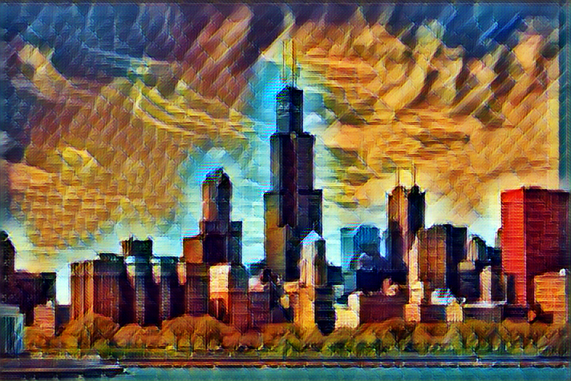
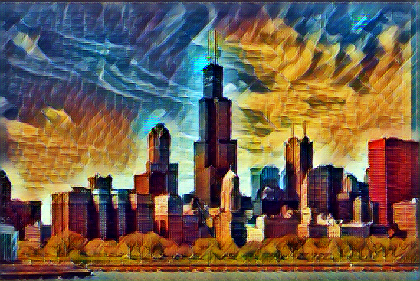

The training ran for two epochs, with 4000 iterations each. Big dataset!! Took more than 6 hours on a K80 on Google Cloud.

# Epoch 0

First 2000 iterations

  
  

3000 (left) and 4000 (right) iterations

  
  

# Epoch 1

  
  

3000 (left) and 4000 (right) iterations

  
  

